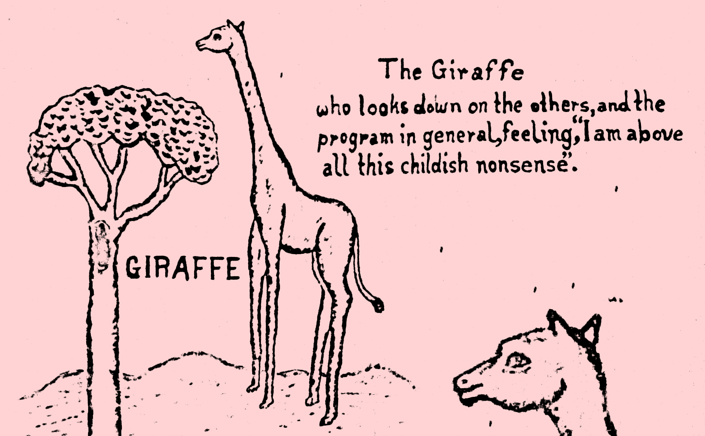

# Subject of Information

Hello there! My name is Joseph Birkner, but I also frequently go by *realitivity* (*Realitivität*). While I'm a software engineer by profession, this site is more dedicated to the writings of mine that do not follow a declarative syntax.

## About

The name of this blog is "*Subject of Information*" (Deutsch: *Informationswesen*), because the phrase has a fun heteronymity to it:
 
1. It means "the topic of information".
2. It describes "a being made of information".

Consider the my blog posts as members of the former, written by one of the latter `:)`.

The art above is derived from wall decorations found in the [Ayensudo Primary School, Ghana](https://ayensudoma.wordpress.com/).

## Posts

* `2016/01/01`: Metapsychologie auf dem CCC [[Deutsch]](blog/5_metapsychologie/de.md)
* `2015/11/10`: Iran [[English]](blog/4_iran/en.md)
* `2015/07/13`: Natural Language Processing [[English]](blog/3_nlp/en.md)
* `2015/01/28`: Deutschland kennenlernen [[Deutsch]](blog/4_deutschland/de.md)
* `2014/07/22`: Leaving Ghana [[English]](blog/2_leaving_ghana/en.md)
* `2013/09/30`: Ramblings on Ghana, Africa and the World [[English]](blog/1_africa/en.md)
* `2013/09/26`: Komenda [[English]](blog/0_komenda/en.md)

## Links

You can find many projects that are really important to me on my [Github page](https://github.com/josephbirkner)!

I also like to hang out on [Twitter](https://twitter.com/realitivite).

## Contact

`blog at josephbirkner dot com`
