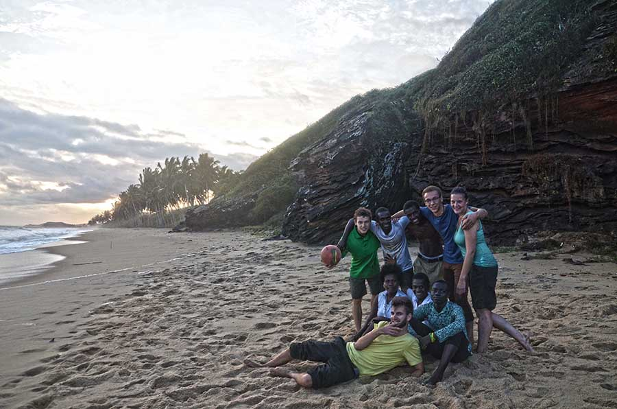

I want my first blog post to be about the beautiful city of Komenda where I am currently living. The town has about 5000 people in it, but more than 30000 are living in its greater area. It is part of the K.E.E.A district (Komenda-Edina-Eguafo-Abirem), and the biggest town there. Situated directly at the coast of the Atlantic, fishing plays a very big role here.

The town is very rich in history and mystery. According to the legends it was founded by a man named Komen who came to the dutch side of Komenda, asking for shelter. The Dutch refused his bid, and told him to go west of the river that was the border of Dutch-Komenda. They also warned him that a monster was living on that side of the river. The Dutch promised Komen, that if he was able to kill the monster, they would give him all of the land west of the river. Of course, it didn't stand a chance! So, Komen gave Komenda it’s name, which later became British-Komenda.

That’s what the legends say. Who knows what happened. But one thing is apparent even from the legend: Komenda was very very much intertwined in the colonial fights between the Dutch and the British for Ghana. There are many remainders visible of that, most importantly the Komenda Castle. Although in really bad shape, damaged by war, age and careless treatment, a lot of it is still surprsingly intact.

Komenda has everything one (Spoiled western white guy) can wish for. A central water supply, electricity during most parts of the day (especially at night), and cellphone reception from three different providers (MTN, Glo, Vodafone). Vodafone is even 3G, so I have a better internet connection here than in some parts of Germany, which is awesome.

What gave Komenda most of its current status is a sugar factory that was in operation in Komenda until about 30 years ago. Nobody knows why it closed. A lot of excitement here right now is due an Indian investor, who is planning to reopen the plant.
