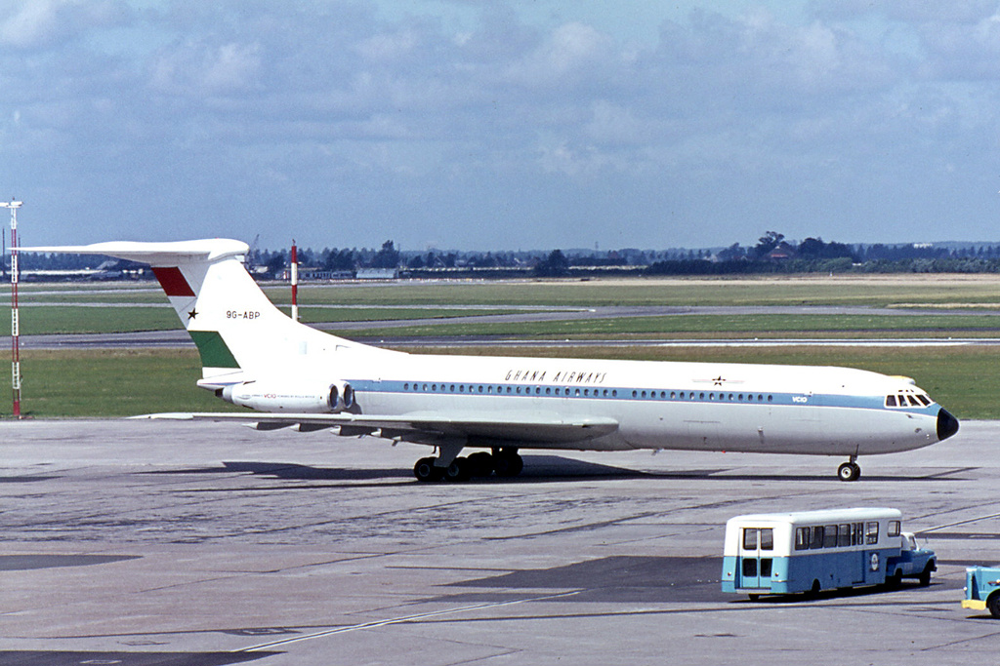

I am going to leave Ghana in August. I would like to explain the “Why” a little bit more.

Some of you know, that for the largest part of the past year I was very certain that I would stay in Ghana, at least until the end of 2014. I went to some length to establish conditions that would allow me to do so: I struck a telecommuting deal with my employer in Germany whilst filling in a temporary teaching vacancy at the University of Cape Coast in Ghana; the combination of which would be reason enough to stay.

Over the past four months though, the bright outlook I saw in staying here transformed into a nightmare of power and internet outages, miscommunication and bureaucracy.

One of my main conclusions is, that I was far too optimistic about promises made to me here. Primarily that goes to the UCC (University of Cape Coast). Prior to initiating the telecommuting agreement with my employer, I made clear to the University that the precondition for my teaching there would be the availability of a secure work environment for my telecommuting job. This devolved into a bit of a carrot-and-stick situation: I was shown my office in the university, even temporarily holding the keys to it, and continuously promised that I would receive a contract for my work "either tomorrow or next week".

Fortunately I learned through a series of happy coincidents that the program coordinator who originally invited me into the university was just a temporary substitute for the actual guy, and probably didn’t even have the authority to create a contract for me. It still does not quite add up to me why he would not say that.

Now I got to know the actual coordinator. He flat-out admitted that he didn’t have the authority to employ me. That left my dream of staying at the university in pieces, until I had the idea of studying there. They would have actually permitted me to do a Master’s in Computer Science, which sounded nice to me. I wanted to stay in Ghana.

That was until I was contacted by Yandex. Yandex is a Russian Company that operates, among other services, the 4th-largest search engine in the world. They picked up my resume on LinkedIn and invited me to participate in an interview for a C++ Software Engineer position in Berlin. I was really curious, especially because the job would have been about enhancing their maps service. I made it through the challenge tasks and the first interview, but didn’t quite make the second interview. Throughout the interview process though, I came to peace with the thought of leaving Ghana for something that may not be as culturally demanding, but far more academically challenging (than studying at the UCC).

After I failed on the second interview with Yandex, I was obviously stuck with a very depressing thought: What if, even after getting a Masters Degree in Computer Science from the UCC, I still wouldn’t have the knowledge to make it through an interview such as the one I just failed?

This is not to discredit the ICT/Computer Science program of the UCC. But indisputably, I do have access to universities in Germany that have far more competence in the field. And also indisputably, Computer Science is one of my core interests.

So, I started looking for academic “computer sciencey” programs in Germany, and actually found one at the University of Stuttgart that seemed to fulfill my urge for academic depth, especially towards creative algorithms and data structures. The program name is “Maschinelle Sprachverarbeitung”, translated to English as “Natural Language Processing”.

This is a really important step for me. I had to choose between science and social engagement. After a year of social work in Ghana, I chose science.
