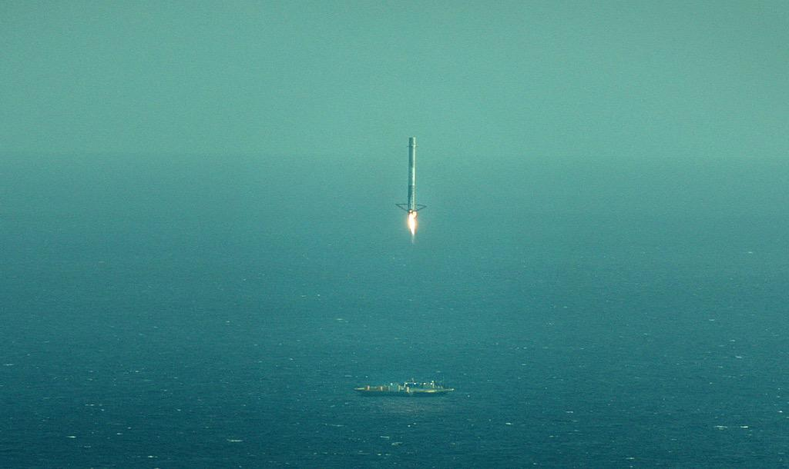
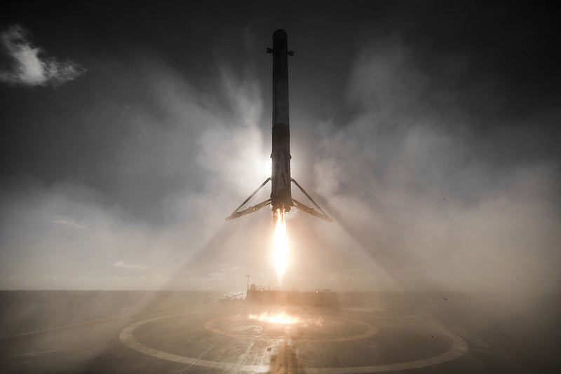
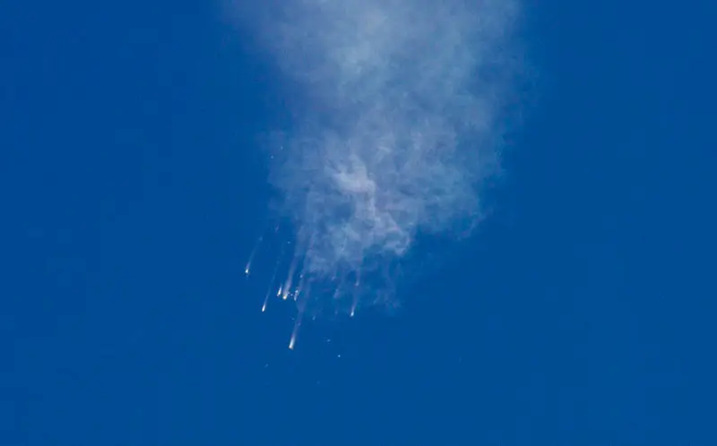

----
title: Why NLP is cooler than Rocket Science: Language as a tool for understanding cognition and accelerating the advent of ASI
---

In the past two or three weeks, approaching the end of my second semester at the University of Stuttgart, I spent quite a bit of time contemplating what I am learning in a broader context, and trying to understand what it actually is that I want to accomplish.

This challenge was amplified by the fact, that over the past two years, we have seen rise to two companies which I have admired for quite a long time; SpaceX and Tesla. I loved cars and rockets growing up as a kid (and I spent a lot of time drawing my own). Especially the emergence of the F9R (Falcon 9-Reusable) Rocket, which for the first time in the history of mankind tries to commercialize a propulsive landing system, seemed to violently awaken my less abstract engineering spirits, because, lets face it: Propulsive landing is insanely cool.

Now as exciting as that is, it was also a little depressing for me, because upon first glance, my studies of NLP could not be further apart from the kind of hard engineering knowledge that is required in building these incredible machines. I seriously questioned whether my line of studies was really the best way to maximize my personal contribution to the technological progression of humanity.

It took me a while, but I have come to the conclusion that that is not the case. This is not to disregard the enormous importance of “hard engineering knowledge”, e.g. electrical, mechanical, chemical & materials. But as much as those more traditional fields are an important foundation, I think it is fair to say that by themselves they do not generate a lot of progress. It is the contributions from Information Technology that really makes their applications exciting. Take for example the F9R. Yes, fundamentally it is a culmination of exploiting every possible bit of hard engineering knowledge. But there seem to be key contributions from IT without which this would have been impossible (at least given the resources of SpaceX):

1. Simulation Technology (see [this](https://youtu.be/n8JqbooVvjA) excellent presentation by SpaceX Director of Research Adam Lichtl and SpaceX Lead Software Engineer Stephen Jones on how SpaceX is exploiting sim tech)
2. Advanced Avionics (to quote the [Falcon 9 User Guide](http://www.spaceflightnow.com/falcon9/001/f9guide.pdf): *[…] Avionics include rugged flight computers, GPS receivers, inertial measurement units, SpaceX ‐ designed and manufactured controllers for vehicle control (propulsion, valve, pressurization, separation, and payload interfaces) […]*)
3. Advanced Computer Aided Design (Including 3D Printing). (See [this video](https://www.youtube.com/watch?v=xNqs_S-zEBY) from SpaceX featuring Elon Musk talking about the future of HMI.)

This is my first important observation: What really made the difference was not advances in engineering, but advances in IT. I challenge every reader to argue with that.

My second highly biased observation (hopeservation?) is that we are probably not nearly at the limits of said three areas of contribution from IT to engineering. (Especially processing-power wise, of course, but that is more like an engineering contribution to IT than vice versa.) But this is where NLP comes in. The holy grail of NLP of course is ASI, Artificial Strong Intelligence. Yes, there are more mechanical approaches, that try to neglect the role of cognition in Speech Generation and Processing, but I think there is a trend towards at least incorporating “Statistical Approaches” (Machine Learning), deviating from the purely rule-based approaches proposed by Chomsky.

And this is exactly where I see my contribution to engineering: With the advent of strong NLP, culminating in ASI, there will be an explosion of ever more advanced applications of traditional engineering knowledge. Engineers will be able to literally discuss designs with their computers. Simulators will be able to identify border cases and design very effective test plans on their own.

Events like the Falcon 9 explosion on June 28th 2015 remind us, that human engineering is far from perfect, because the complexity of our machines tends to increasingly exceed our cognitive capabilities. This is why we need artificial intelligence.