# Iran

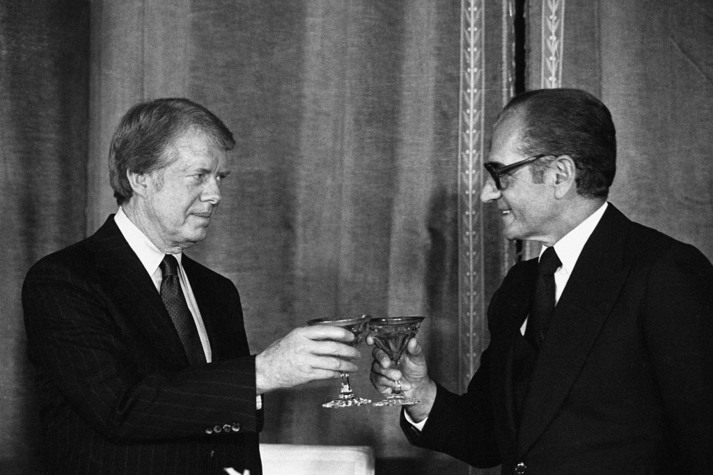

So, I got to spend 12 days in Iran! Excitement! Of all the non-european vacations I have taken so far (USA/Ghana/India), this was definitely the most controversial to explain to people. That may be, because in our 24-hour news-cycle based society, “Iran” currently mainly appears as “anti-western”. Between a toxic mix of American/Israeli led propaganda (*Axis of Evil!*) and Iranian/Russian counter-propaganda (*Great Satan!*), which leaves the general public in a “grey goo” of information, anybody can cherry-pick their news to reinforce their version of “the truth”. Quite unsatisfying, ain’t it? Funnily enough, I met a guy on his way home to *Nigeria* at the Munich airport, whom I got to help move his luggage into the elevator. When I told him that I was going to Iran, he said, *“Isn’t that dangerous though?!”*. Once more, this demonstrated to me, that most places you might consider “dangerous” are probably inhabited by human beings living peaceful lives.

The idea of visting Iran had been bouncing around in my head for a while now. Not just to confront the “grey goo” with a filter of actual experience, but also because somewhere at the back of my head, I remembered that “Iran” was actually “Persia” for the largest part of history; and “Persia”, I associated with civilizational galore, pomp and pop culture.

In a pencil stroke of fate, my former living arrangement at the University of Stuttgart brought me into a shared apartment with an amazing guy from -you guessed it- Iran. Kasra was (well, is) doing his M.Sc. in Environmental Engineering in Stuttgart, and there turned out to be a substantial intersection between our world views. So we got along pretty well. Him being a rare first-hand source of experience on life in Iran and the middle east, we spent hours on talkshow-like exchange of information, where I got to drop my questions, one oblivious belief at a time, and he had the joy of setting an uninformed foreigner straight on the status quo of his country.

I mainly learned, that I knew nothing! Thus, it was obvious to me, that I had to make my own experiences. Next payday, I booked myself a flight to Tehran for 25th September. First pleasant surprise: Travelling to Iran seems to be upsettingly cheap nowadays. I paid about 400 Euros for a roundtrip flight with Emirates, the no-compromise, 50s flair, luxury airline of the UAE, and got to travel in an A380! Shivers of joy! 🙂 The visa acqusition was, after some initial confusion (half-assed online enrollment system and conflicting instructions on different embassy websites), determined to be something I could get done upon arrival at the airport.

## Tehran

The thoughts that bolt through your mind when you confront a corner of insanity in your brain with facts can be funny in restrospect. In my case, the insane fear I had when I sat in the plane, and the constant thoughts about the things airport officials might do to me when they encountered the illegal bottle of wine I was carrying in my luggage as a present for Kasra. I pictured thorough stares, and guards who would be able to smell fear from a mile away.

The reality upon touchdown was quite more down-to-earth. I should mention that I arrived at 2:30 in the morning! Along with me, about 40 other people, who also had the same genius plan of getting their visas at the airport upon arrival, at 2:30 in the morning.

The officers in charge were decently challenged with the flood of eager foreigners. Anyway, long story short: After roughly 90 minutes, the first guy got his visa, holding his passport in the air like a trophy. 4:00 AM. The crowd was on fire!

After about 2 hours, I, too, had my victory lap, got my luggage, and exited immigration with a friendly nod from the customs guy. A minute later, I got to hug Kasra and his dad, who had been waiting for me for over 2 hours with no means of knowing whether I arrived or what was going on! I think we all had a tear in our eyes, it was an unbelievably great moment.

After a good day’s sleep, I was all up and ready to discover the land I knew nothing about. Come evening, we set out on our first tour through the city of Tehran… and, what can I say! It’s a gemstone! In retrospect, I can only conclude that Tehran is probably the most original place I have ever visited. It’s the silver lining of the fact, that Iran was mostly drained of tourists and sealed off from globalization throughout at least the last 10 years. A rare piece of well-maintained cultural uniqueness, “unbetrampled” by Tourism and Commerce. At this point, let me share a few pictures from that mother of evening walks:

During the first three days in Tehran, I also learned most of my Farsi vocabulary! Here’s what I memorized:

* *I’m Joseph! – Man Joseph hastam!*
* *I’m from Germany! – Man almane hastam!* (You get the pattern…)
* *Thanks/thank you! – Motshakaer/Motshakaeram!*
* *Yes – Are*
* *Hello! – Salam!*
* *Sob Bekher! – Good Morning!*
* *Good bye – Khodahafez*
  (The literal translation being “God save you!”)
* *Man Iran ra dust daram! – I love Iran!*
  (Interestingly, the literal translation being, “I have Iran as friend!”)

To all those who are wondering what Farsi is: It’s what the Arabs made out of the word “Persian” when they invaded Persia in 651 A.D. They couldn’t pronounce the “p”, so, it became an “f”. Thus, over time, “pers” became “fars“.

Apropos: All in all, the Iranians, seem to have a fairly bipolar relationship with the Arabs. On the one hand, they share some culture (Islam, duh.) On the other, they aren’t united even on that front: Obviously, most Arabs (Saudi Arabians, in particular) believe in Sunni Islam while Iranians, on the other hand, are about 95% Shia. (The rough analogy with the former conflicts between Protestantism and Catholicism are stunning: Just as the Protestants fought the belief in Pope Peter being the directly appointed successor of Jesus and therefore, leader of all Christians, the Sunnis are differing with the Shias on whether Prophet Mohammed directly appointed Imam Ali as his successsor and leader of all Muslims. That’s where the analogy ends, though, because the Sunnis really are NOT in any way the reformists among the Muslim community, and neither are the Shias.)

But, the differences go beyond religion, in light of the fact that a large share of Iranians that are deeply unreligios, but attached to Persian culture. If that comes as a surprise to you (Like, “What? Non-religious Iranians?” or “Persian culture? What on earth is that!”), here be knowledge upon you: Until 1979, The Islamic Republic of Iran used to be the Kingdom of Persia. And the Persian Kingdom was a fairly progressive, luxury-loving realm. In fact, so progressive (as in western-inspired) towards the end, that large parts of the Muslim population got offended and united in anger around Imam Khomeini, kicking the Shah out of the country. Up until today, though, there is a big shadow population of non-Muslims who then went in the other direction, and now, to my experience, tend to idealize the former monarchy. Let me explain this in detail:

## A country, retracted into its shell?

Everybody has met bullies in their lives. I’ve met a couple, and to some degree it probably influenced my personality. It made me more modest, wary of overly popular kids, and more likely to sympathize with underdogs. The country of Iran, in its long history, especially in the youngest part of it, though, has encountered many bullies, one of whom is certainly among the biggest in history: Winston Churchill.

For a long time, Persia was a bully itself. 550-330 B.C., the Kingdom of Persia (The Achaemenian Empire) was spanning across Greece, Egypt, Turkey, Syria, Iraq, Afghanistan and northern India (much to the credit of Xerxes). “India” (then actually the Mughal Empire) was invaded by a Persian king for a second time in 1739, when Nadir Shah, the so-called “Napoleon of Persia”, invaded Delhi. (This is, by the way, how the Koh-i-Noor (Mountain of Light) and Daria-i-Noor (See of Light), the world’s two largest diamonds, left India for the first time.)

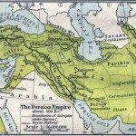

Things changed over the course of the 19th century. The ruling Qajar Dynasty was faced with a less and less influential kingdom, which increasingly lost power to the Russians from the north and the British from the north-east. A century of modern-day bullying began. Along that trend, British and Russian forces occupied Iran for the first time during World War I. British plans to incorporate Iran into the Empire through the Anglo-iranian treaty of 1919 failed to take off, though. In 1925, the burned out Qajar Dynasty was replaced by the Pahlawi dynasty, spearheaded by Reza Shah Pahlawi.

Interestingly, Reza Shah Pahlawi strongly aligned Iran economically with Germany. He was looking for a counterweight to the British influence, and according to Wikipedia, “(Nazi) Germany was happy to take that role”. (I feel tempted to mention, that the etymology of the word “Iran” stems from the Persian “Aryan”.) Thus, coming up to the beginning of World War II, Germany became one of Irans most important trade partners. An unfortunate choice of friends, that turned out to be. But, the sympathy with underdogs certainly seemed to be developing.

When World War II began, Iran was caught between the frontlines, and therefore, chose neutrality. Again, an unfortunate choice. Neither the Soviet Union nor the British were willing to accept a resource-rich, strategically well-placed, quasi German ally anywhere. Thus, they occupied Iran, again, forcing Reza Shah Pahlawi into exile, handing power over to his son, Mohammad Reza Pahlawi. Bully on, y’all!

After World War II, Churchill probably knew Iran pretty well (after all, one of the deciding war conferences among the allies was the Conference of Tehran in 1943). The reason why Iran became important was because of its oil reserves. And, although, Iran was never a British Colony, British oil companies (*cough* BP *cough*, formerly known as the Anglo-Iranian Oil Company), were invested into Iranian oil reserves in quasi-colonial ways, carrying home huge profits.

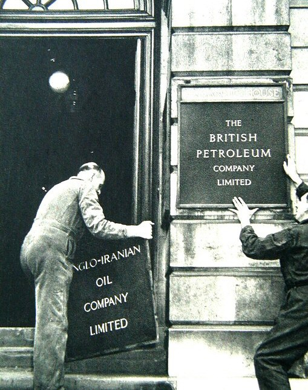

One may be inclined to allege the British of at least a little nostalgia for their fading empire after World War II. And one may further conclude, that this nostalgia might have resulted in a significant perception of entitlement, or victimization, to say the least. Thus, over the course of the 20th century, the British foreign policy seems to have turned from “We’re peace-loving benefactors” into “We’re annoying bullies, seizing every opportunity to remind everybody of our self-proclaimed importance”. (If this sounds slightly passive aggressive to you: Yes, I’m holding a grudge against the U.K., mainly because of their involvement in the Iraq war, the role of the GCHQ within Five-Eyes, their obstruction of financial regulation in the EU, and their unwillingess to participate in a European solution to the current refugee crisis.)

Such an opportunity arose in 1953, when the first democratically elected Prime Minister of Iran, Mohammad Mosaddegh, attempted to nationalize the assets of the Anglo-Iranian Oil Company. Churchill convinced Roosevelt that Mosaddegh had to go, and thus, the CIA and the MI6 joined hands in “Operation AJAX”, which brought the son of Reza Shah Pahlawi, Mohamed Reza, back to power. (By the way this is, after years of denial, declassified information now, and Obama formally apologized during his Cairo Speech in 2009.)

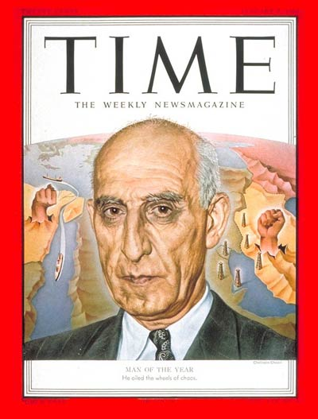

Mohammad Reza Shah Pahlawi was as inspired by western utopian visions, as he was detached from the realities of his country. Empowered by the western bloc, he felt like nothing could stop him. He fought socialist movements in Iran with ruthless brutality, and maybe, he thought, that would buy him unlimited sympathy from his benefactors. He overstretched it, though, when Iran joined the founding of OPEC in 1960, and thus, indirectly supported the Oil Crisis of 1973, which OPEC triggered in protest to U.S. Aid to Israel during the Yom-Kippur War.

The detachment from his people, along with the gradual detachment from his international supporters, eventually resulted in freefall. In 1979, the Islamic revolution in Iran ended the monarchy. The new Iran was, tormented by the toxic foreign involvements of the previous 100 years, vigilant of foreign influence. And, the way I feel about it, it’s still rectracted into its shell. So, next time you hear about this missile being tested or that Journalist being detained: Maybe, think of it as a very emotional reaction to a long history of abuse.

## Moving on

In the following 3 days, we explored more of Tehran. Not enough by any means to get a complete picture of that 9-million-people mega city. But “sufficient to cover the most important sights”, which is what most of our planning revolved around (agreed: it sounds pathetic and I should have spent way more time there!) On Sunday, we visited Golestan, the palace of the Qajar dynasty. We hit a lucky streak and managed to arrive on “National Museum Day”, so we got free entry! Golestan is mainly a typical 19th-century palace. But, certainly interesting in that it displayed the degree to which those 19th-century monarchies were globalized. I saw a royal American-built typewriter, German porcellaine and looking glasses and Russian samovars. The monarchies loved each other!

Afterwards, I saw an even more impressive display of monarchical heritage: The Iranian royal jewelry collection (“The National Treasury”). Locked down in a (probably) nuclear-grade bunker under the Central Bank in Tehran, they are keeping stuff like this: An approximately 1.5m tall, jewel-studded globe from the Iranian National Treasury, dating back to the Qajar-Era.

The next day, we visited the Palace (or rather, Palaces) of the last Iranian dynasty, the Pahlawis; the Sadobod complex. Nowadays, it’s actually a park of museums, with the Pahlawi’s Mansion just being one of them. We visited the royal car museum, which contained an expensive looking collection of bullet-proof Mercedeses and Rolls-Royces. The most thought provoking item, though, I found to be, was this picture: Cyrus Reza Pahlawi, the Sha’s son, who now lives in Maryland, cruising down a beach on a four-wheeler.

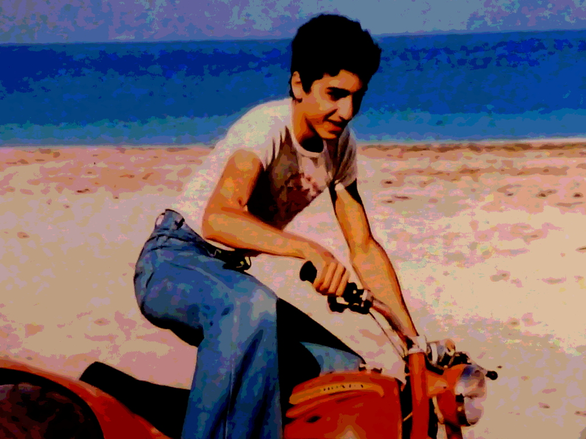

We then visited the military museum, which had weapons and was hilariously overstaffed by bored recruits for whom apparently no other occupation was available. And finally, the royal mansion, or “The Green Palace”, as they call it.

Since that was actually a 20th-century building, where even Jimmy Carter set foot, it felt slightly too close to be “just another palace”. I’ve seen talks by Jimmy Carter and I’m a huge fan of the Carter Foundation (their first rule being “Failure is an option”, which I straight up adopted). Anyway, in September of 1969, the Apollo 11 crew visited the Shah. Almost 10 years later, on the 31st of Dec. 1978, Carter celebrated New Years at the Palace, in what amidst growing anti-american sentiment within Irani society turned out to be another nail in Pahlawis coffin.

The next day, Tuesday, we took a break from history, and went for a morning hike in the vastly beautiful mountains that surround Tehran from the north (bringing to mind images of Minas Tirith from LOTR. Insane!):

## Time travel

Tehran has been the capital of the Persian Kingdom since 1789. Before that, it used to be the city of Esfahan. Before that (about until 1509), it was (roughly) the region of Shiraz. And WAY before that, Darius and his son Xerxes used to rule from the halls of Persepolis, until Alexander crashed the party around 330 B.C. This is what it looks like on a map:

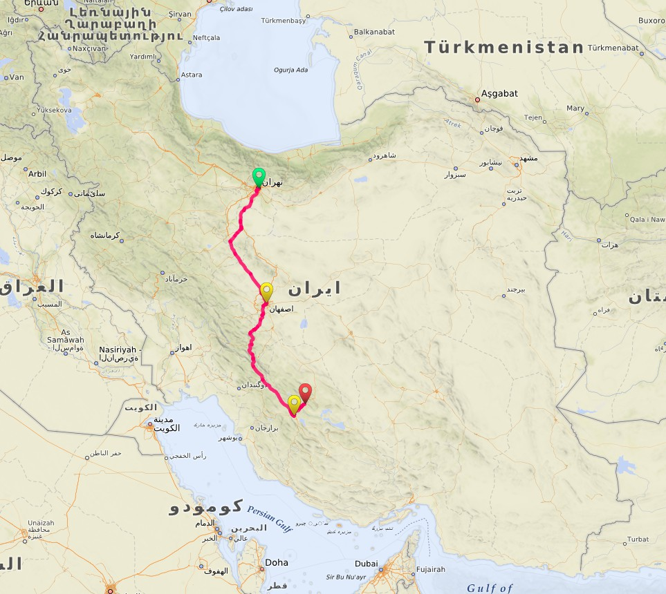

The obvious observation: Throughout history, the capital moved north until it hit the mountains, which gave it a nice protective shell from the top. Anyway. In consequence, a trip south along that line does feel like a trip back in time.

## Esfahan

So, on Wednesday, the 30th of September, we hopped into our bus-sized time machine and started on the journey southward. We had roughly half an hour before the bus set off, and decided to take a little walk. The oblivious foreigner I am, I immediately decided to befriend a cat in a nearby park.

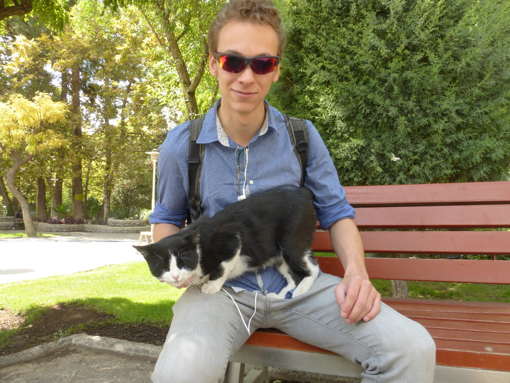

After about 5 hours of driving through an, at times, upsettingly photogenic desert, we arrived at our hotel in Esfahan. Nowadays, the city is mainly known as Iran’s cultural capital (Disclaimer: The “cultural capital” title seems to have competing claims to it). Also, it is significantly more conservative than Tehran. Being home to the elite of the Persian carpet manufacturers, it used to be a very popular tourist attraction, and was nicknamed Nesf-e-Jahan, which means “half the world”: Because you could literally meet half the world there.

Esfahan was mainly built by the Safavid dynasty (1501-1722), which managed to unite Persia for the first time in almost half a millenium. Certainly, the most impressive site there is a humongous square, the Naqsh-e Jahan Square. In retrospect, this was probably the most memorable location I visited, for the sheer number of things to look at. First of all, there is that huge square. But then, that square is surrounded with exclusively interesting things: There is the former royal ceremonial platform, the so-called Ali-Qapu palace. (Funnily enough, I met a bunch of German tourists there, and we had a pretty good time.) Then, on the other side, there is the most beautiful building entrance I have ever seen: the entrance to the Sheich-Lotfollah-Mosque. And then, wherever there is no palace or mosque entrance, there are shops that offer exclusively nice things. I don’t know how much time I wasted looking at those, but in the end I spent about 100 Euro there on delicatly embroidered carpets and camel bone boxes 🙂

Also, it has three of the most beautiful pedestrian bridges in the world; The Marnan bridge built in 1599, the Si-o-se Pol built in 1632, and the Khaju bridge built in 1650.

Certainly contributing to the beauty of the experience was also the fact, that the whole city was in a good mood because of the Eid celebrations: Everybody got together to give each other free food in appreciation of the fact that Abraham didn’t murder his son Jacob, and therefore passed God’s test. I received free tea, yoghurt and snacks, and was subsequently also happy about Abraham’s lack of insanity.

All in all, Esfahan was just great. On a side note, it was the place where I got to befriend the most shop owners. Like this guy, who happily told me in broken German, his memories from Hamburg:

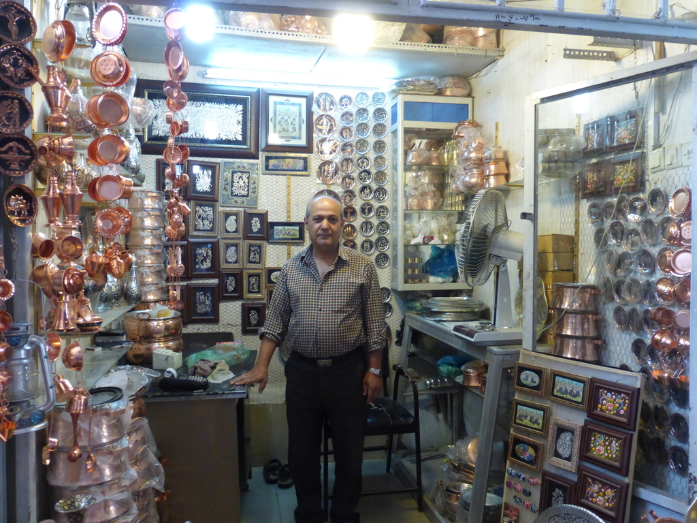

Or this guy running, an outrageously tantalizing fruit shop, from which I purchased a kilogram of grapes:

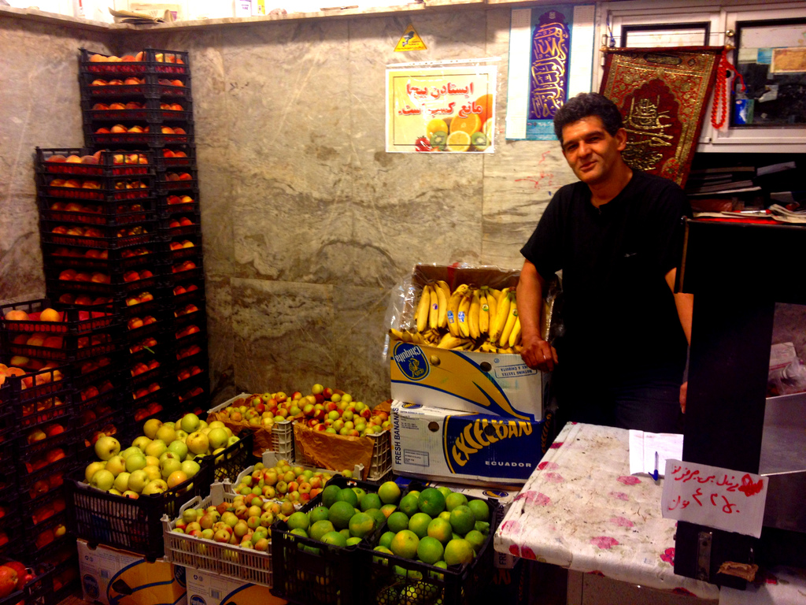

## Shiraz

After a good night’s sleep (and some good grapes for breakfast), we continued our time trip, taking the bus to Shiraz. The landscape on that trip was even more photogenic than it was on the way to Esfahan.

Our hotel was a slightly 80’s flair-ish site in the north-east of the city, carrying the inspired name “Tourism Hotel” (so there was definitely no ambiguity to its purpose.) Shiraz is also home to Iran’s most expensive Hotel, the Grand Hotel Shiraz, built during the Pahlawi era (of course). Memorable, because when entering Shiraz at night, it looks like passing a giant spaceship

In retrospect, the fact that I only spent 2 days in Shiraz and 1 day in Esfahan gave me a false sense of the size of those cities. Shiraz has a whopping 1.4 million inhabitants, Esfahan has 1.7. But, since I never really moved beyond the city centers, they felt much smaller to me. I’m still a little befuddled by the sheer scale of my underestimation, especially Shiraz’s, where I missed by orders of magnitude. On another random note, Iranians seem to have a pretty good taste in picking German partner cities: The partner city of Esfahan is Freiburg on the German southern border, and the partner city of Shiraz is Weimar, home to Johann Wolfgang von Goethe!

They call Shiraz “the birthplace of Persia”. But, more importantly, according to Wikipedia, it is also apparently the birthplace of -wait for it- … wine! The oldest archeological sample of wine EVER found was at a digging site near Shiraz, and dated to a whopping age of 7,000 years! It still funds government operations to this day. Kidding you, I am.

The city itself is about 4,000 years old, with numerous Persian kings establishing it as their capital throughout history. Interestingly, Shiraz was rarely the capital itself, but always in close vicinity:

* It was about 40 km away from the capital of the Achaemenian Empire, Perspolis (550-330 B.C.)
* It was equally close to Ishtakhr, the capital of the Sassanian Empire (200-650 A.D.)
* For a brief 110 years, it was the capital of the Buwayhid Empire (945-1055)
* Slightly breaking with the whole time travel story, the Zand dynasty made it their capital again, briefly, from 1762-1789, until the Qajars finally rose to power and moved the party to Tehran (this transition of power, by the way reads like an old testament bible chapter, or a season of Game of Thrones: The last son of the Zands, Lotf Ali Khan, took refuge in the city of Kerman from the Qajar army. After some of his men betrayed him and opened the city’s gates, he took revenge on the people of Kerman by extracting 20,000 eyeballs from them and pouring them in front of the victorious Qajar leader. In retaliation, Lotf Ali Khan was blinded, castrated, imprisoned, tortured and raped by the first Qajar Khan, Agha Mohammad Khan). Anyway.

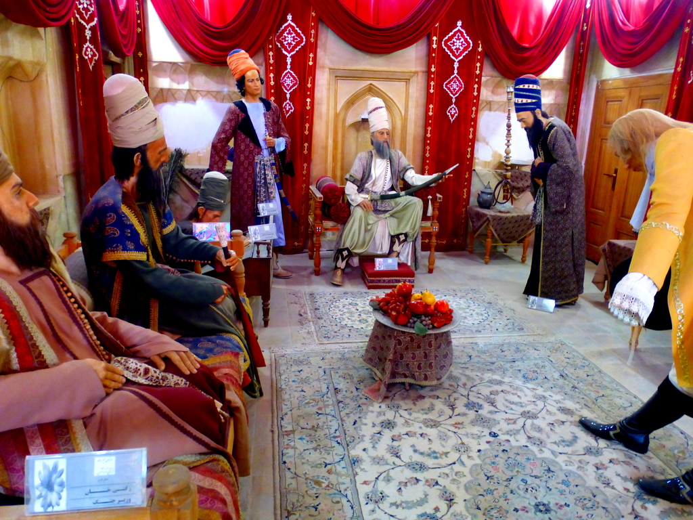

The buildings that I got to look at were mainly built by Kharim Khan Zand during those brief 30 years in the 18th century. Kharim Khan Zand refused to adopt the title Shah, instead he opted for Vakil e-Ra’aayaa; “Representative of the People”, which explains why the Zand dynasty only really lasted for 30 years.

First, we visited the Kharim Khan Citadel, which was built in a staggering ONE YEAR, from 1766 to 1767, although it looks more like an 11th century castle. From the inside, it has a super nice garden, impressive wall art and a bath house. But, nothing overly luxurious, which definitely makes Kharim Khan look like a bearable person. Afterwards, we also visited the public bath house that Kharim Khan built for his people. He’d certainly have my vote!

Finally, we also visited the largest mosque in Iran, the Vakil Mosque, also built by Kharim Khan. It was actually the first mosque I ever visited! The whole thing was super beautiful, but one detail I found most interesting: During prayer, in order to de-emphasize the social rank of the Imam, he descends about 50 cm into a hole in the ground. Progressive!

## Persepolis

Come next day, we continued our stride on towards the halls of Perspolis, the final destination of our journey. I feel slightly unqualified trying to convey the enormous power that still radiates from those ancient blocks in a couple of paragraphs. Perspolis is just the go-to tourist attraction of Iran, sharing historical rank of significance with the pyramids of Gizah and the Acropolis in Athens.

Perspolis was originally built as one of king Darius I’ many residences, but, it’s main purpose was to serve as a gathering point for the representatives of the Achaemenian empire’s provinces during the new year’s celebrations. A symbol of power for the minions to look up to.

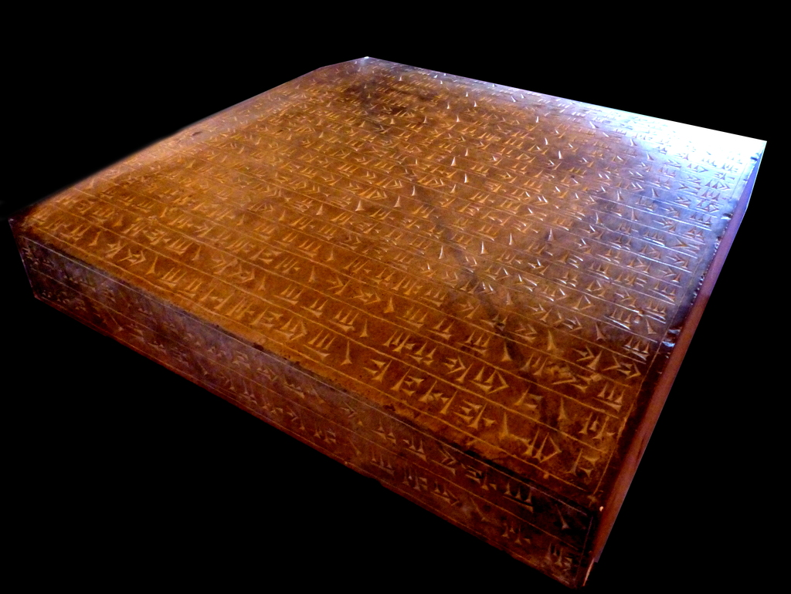

From a linguistics point of view, it turned out to be a treasure chest of corpus material, reaching from foundation stones inscribed by Xerxes himself to bookkeeping plates proving the fact that Perspolis was not built by slaves!

After the fall of the Achaemenian empire, it served mainly as a materials resource for the surrounding cities, especially the capital of the Sassanian empire, Ishtakhr. Over time, knowledge about its origins was gradually lost. The first serious archeological exploration was conducted at the beginning of the 1930’s by no other than German archeologist Ernst Herzfeld, yet with funding from the Oriental Institute of the University of Chicago.

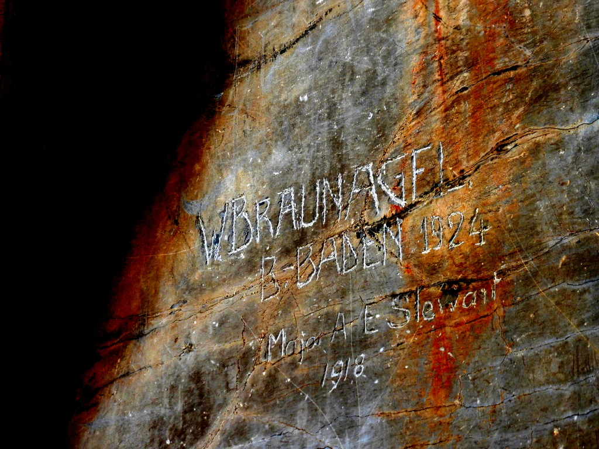

## Wrapping things up

In the morning of the next day, we boarded a regional flight back to Tehran. The last two days I spent with Kasra roaming through the city, buying last-minute souvenirs and taking deep breaths for the oxygen to process the volumes of experiences I got to make in the previous 10 days.

There are a couple of things that I still really need to talk about, though:

### Currency and numbers

Spending money in Iran is not a trivial undertaking. First of all, you need to get the money into the country, which you cannot use credit cards for because of the current sanctions. Then, you need to determine how much you need. If you’re good at counting zeros, you have a clear advantage because the exchange rate from Euro to Rial is a staggering 1:3800. random-002Then, once you have the money, you need to determine how much you are actually holding. Even though Europeans adopted Arabic numbers, many arab countries and Iran too adopted the so-called Hindu-Arabian numbers, which look like this: ٠‎ ١‎ ٢‎ ٣‎ ٤‎ ٥‎ ٦‎ ٧‎ ٨‎ ٩ . Now, you can almost read the price tags. Almost, because, you need to know that there are mutiple currencies used in Iran: There is the official Rial (1:3800), there is the semi-official Toman (1:380), and there is the street currency  that just omits all the zeros (which Kasras brother introduced to me as “G”):  1:3.8. Confusion ensues mainly between Rials and Tomans.

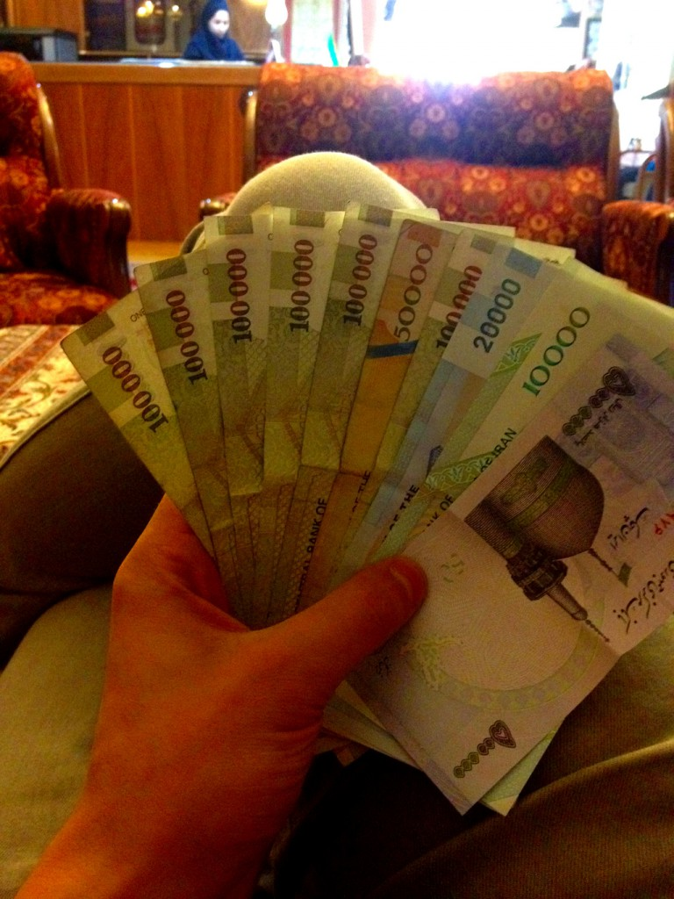

### Hijabs

Islamic rule dictates that sexuality carries an inherent evil in it, and therefore, it must be denied in every way possible. Particularily evil and in need of oppression was apparently female hair. I know, self-explanatory. Therefore, Iranian women are legally required to cover their hair in public by means of a piece of cloth over their head called the “hijab”. Women being sneaky devils found out how to wear the hijab in ways that are by no means supportive of the original intention.

### Iran’s relationship with Germany

As already mentioned before, Persia (and later, Iran) had a very interesting relationship with Germany, beginning with the rule of the Pahlawis. Iran’s rivalry with two allied powers (Russia and the UK) put it in into a natural alignment with Germany, resulting in massive on projects stretching from railroads to nuclear power plants for German companies in Iran, and huge trade volumes, with Germany being Iran’s largest trade partner for most of the 20th century. On the other hand, things were not always hugs and cake between the two: Germany supplied Saddam Hussein with knowledge about ABC weapons and technology, which resulted in the chemical weapons stockpile that Saddam later used against Iran in the 1980s. There is a tight-lipped commemorative memorial in front of the German embassy in Tehran to remind people of that.

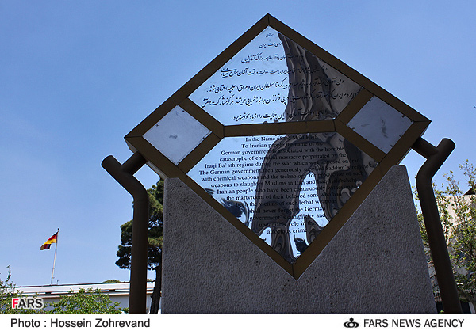

On the OTHER hand, the Iranians [did this](https://www.flickr.com/photos/pgeist/albums/72157657252530944) in order to celebrate the 25th anniversary of the German reunification, which coincided with my stay!

### Calendar

Iranians have to know not one or two, but three dates every day: The Persian solar date, the Arab lunar date, and the Gregorian date: In Iran, it is currently simultaneously the year 1437, 1394 and 2015, respectively. [Source](http://www.iranchamber.com/calendar/converter/iranian_calendar_converter.php)

### Cats

The Persian's love for pride and luxury puts them into a natural friendship with cats. It is stunning how many incredibly photogenic cats I saw during that trip!

### Food

Persian food is some of the best food I have ever had. It ranges from sweets and pastry to incredibly well seasoned rice and many different kinds of bread to all kinds of meat.

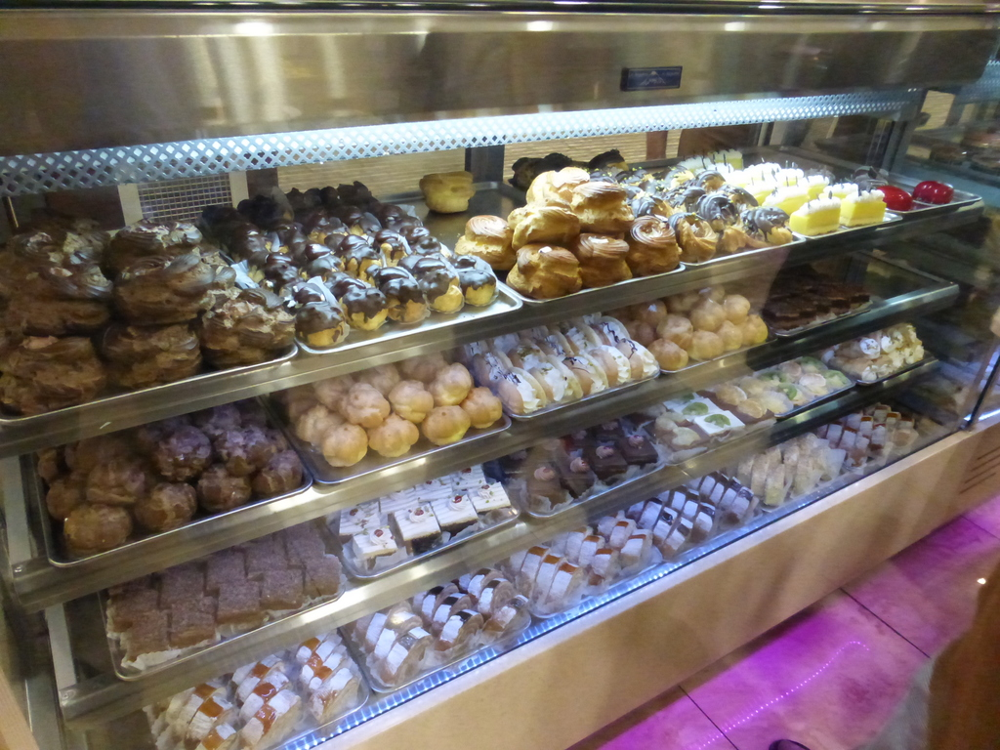

## Conclusion

Visit Iran! I’m definitely gonna go there again (I totally missed out on the Caspian sea, the Persian gulf, and the desert!). It is a historically vastly significant country, and I can only recommend you to take a deep breath of it.