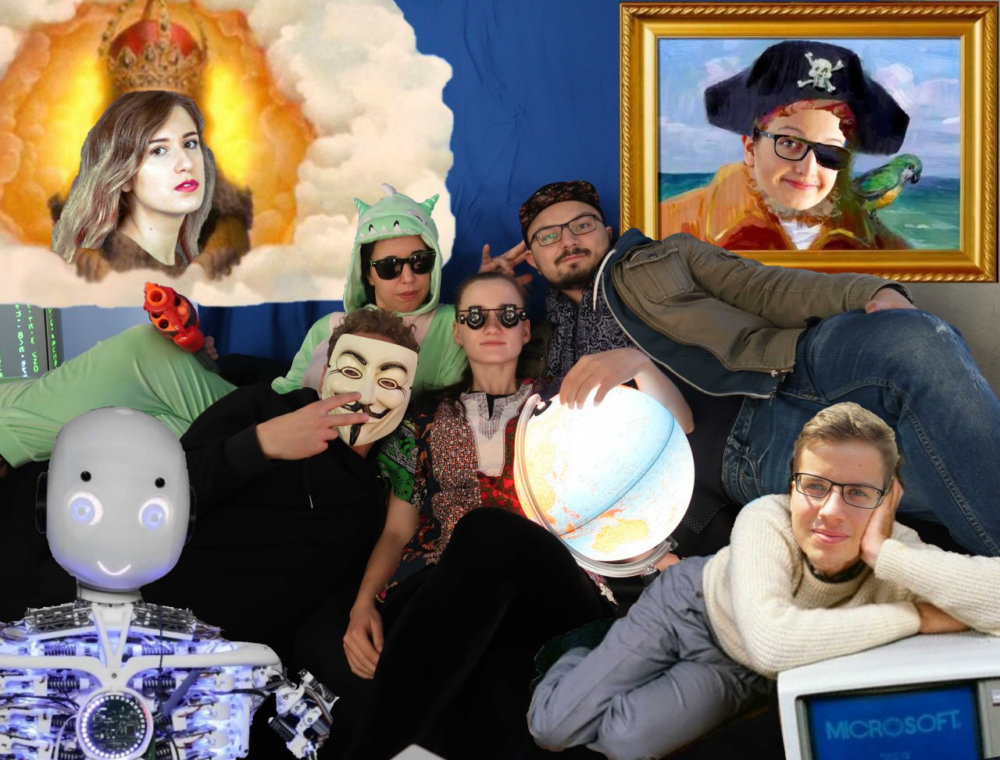

Ten Years of Science
====================

From Winter of 2014 to Summer of 2023, next to my day job as a programmer, I went to university. And in June of 2023, I finally got my degree as a Master of Computer Science at TU Munich! 🍻 Here is my index of wonderful people I got to meet, who inspired and helped me along the way to keep building, learning and writing nice things.

University of Stuttgart: Great in (Big Bang) Theory
----------------------------------------------------------

* 2014-2015
* Reference [previous blog post](../3_nlp/en.md) about motivations for studying computational linguistics:

### Memorable Lectures

* [Andreas Kolross](https://www.igt.uni-stuttgart.de/team/Kollross/): Maths (continuing the great High-School Math teacher Thomas Schönfeldt)
* [Apl. Prof. Dr. rer. nat. Hertrampf](https://www.f05.uni-stuttgart.de/fakultaet/personen/Hertrampf-00001/): Logic and Discrete Structures, Automata.
  * Klausurvorbereitung.pdf, FSA
* Syntax and Pragmatics with Jonas Kuhn

### Great minds, greater friends

* Met close group of great friends through the legendary shared dorm kitchen: Sanchi, Hilde, Agnesh, Kasra
  * Many nights of watching "The Big Bang Theory".
* Built Cleoling (**fix cleoling.com**) with Tillmann Doenicke
* Finally: Got to meet the great Glorianna Jagfeld, PhD. as the "Fachschaftsratsvorsitzende" :)

To the Mun(ich): Computational Linguistics at the LMU
-----------------------------------------------------

Motivation for switching to Munich: A new job in Ingolstadt, and a general lack of "Sitzfleisch". 2015-2017.

### More great minds

* Maximilian Hadersbeck, Program Coordinator. Died
* Hans Leiß (Logic, PROLOG)
* Helmut Schmid (Statistics)
* Alexander Fraser (Information Extraction)
  * Seminar Slides on Weakly Supervised IE
* Aki Naritomi, Japanese. Link 
* Had a great time with the game programming course by Clemens Schefels and Yingding Wang on **Planet of the Grizzlies** with my team-mates Matthias Müller und Constantin Stergiou!

### My Bachelors Thesis

* I got to know Yingding Wang as the second teacher of the game programming course.
* I Learned about AWS, Docker, Flask, Tensorflow
* And Learned about Roboy Hackathons via a sticker on his desk.
* Finally, thanks to him, I managed to write a thorough bachelors thesis on Information Retrieval with Language Models at his chair, which I am still proud of.

And beyond: My Masters at the TUM
---------------------------------

In trying to pivot from software to hardware, I started to pursue my masters in Robotics at the Technical University of Munich.
In 2018, After an intense year of exclusively programming for Klebert Engineering, the time had come for me again to diversify my gray matter.
I had to summarize my motivations for applying to the Robotics program, which I still consider true:

*WHY I believe that entering the M.Sc. Robotics, Cognition, Intelligence program at TUM is both a logical and desirable choice for my path
of studies:*

* ***Reason 1: Robotics & AI are prime ingredients for the technological and social advancement of contemporary society***

  * ***Automation reduces poverty and increases social mobility:** Just like the invention of the automated washing machine as a mass-market
product was an almost unprecedented equalizing factor in the struggle for gender equality, no less is to be expected from the further 
automation of mechanically laborious tasks which traditionally suppress the academic development of the social minorities who are typically
assigned with them.*

  * **Robotics as a means of tackling environmental problems:** Various forms of plastic shreds engulfing our planet are humanitie¿s
environmental legacy of the 20th century. Technology may have caused this problem, and technology will be needed to solve it, as millions
of square kilometers of land and cubic kilometers of oceans will need to be cleaned. Robotics and computer vision may prove to be 
valuable disciplines to automate this undertaking.*

  * ***AI will help humanity become a space faring civilization:** In part due to performance and manufacturing cost improvements in embedded
storage and processing systems, humans are now able to build avionics systems with sufficient control authority to propulsively land orbital
rockets, which vastly reduces the cost of access to space. Impending commercial activity in space will be in high demand of robotics 
systems that are able to perform remote and unsupervised construction and maintenance jobs.*

* ***Reason 2: Background in Software Engineering and B.Sc. in Computational Linguistics***

  * *As much as research and innovation is required to develop and improve Reinforcement Learning models, an important part of any task 
related to Computer Science is always the rapid and iterative implementation of algorithm designs. With a vocational training in Software 
Engineering and continuous uninterrupted occupation as a Software Engineer since 2012 (mainly in C++ code bases), I believe to bring a 
strong programming foundation into my studies. This will be very useful to accelerate research through rapid and less erroneous 
implementations, better code performance and improved software maintainability.
Furthermore, during my Bachelor's studies I have experienced a lot of exposure to particular topics that will be important in Robotics & AI,
such as (audio) signal processing, Linear and Non-linear / Statistical and Neural Machine Learning Models and Recurrent Neural 
Networks, which I am implementing in Tensor Flow for my Bachelor's Thesis.*

* ***Reason 3: The puzzle pieces I expect***

  * *An important factor for the potential success of my studies has always been how well I can attach the "puzzle pieces" that I learn in
university as answers to particular questions that I have asked myself and thought about before. Such questions include for example "How
would I apply Machine Learning to motion planning?", or "How would I model an embedded representation of a robots current state within
it's environment?", or "How could a Neural Network be improved to be able learn both discrete and fuzzy information?".
I am having a hard time trying to come up with information that I might learn during my studies, that is not related to at least one of the 
questions that I am already asking myself furiously!*

I also had to write an essay on the topic of [*Can Computers Think?*](../6_compthought/thought.md). The thoughts in this essay have stayed with me to this day.

### The Roboy Project

My time with Roboy, a legendary tendon-driven humanoid robotics project, started in the summer semester of 2018.
The memory of Yingdings description of the Roboy Hackathon was somehow still on my mind, and when I heard
of the hackathon being run again in the summer of my first semester, I immediately signed up. I had a ton
of fun there, and was immediately extremely taken away by the many awesome people I met: Alona, Simon, Negin,
Kevin, Luis, Daniel (both of them), ... :D So, I signed up for a practical course at Roboy during
Winter of 2018.

My knowledge with Computational Linguistics was very helpful, actually. Roboy had a dialogue system
to talk to people around him. So, I was very welcome in the team (or *Guild*) which worked it,
*Roboy Cognition*. We made a neat motivational video in the beginning, and an even better one at the end!
Summer of 2019 then saw me putting everything I got into a complete rewrite of the dialogue system,
using something called the *Gaybar Algorithm*. At least, that is what I called it initially.
Our name selection process actually finally got us to **Ravestate**: Allegedly, the best and most flexible software
framework for writing human-robot interaction policies up to date!

And in Winter of 2019, I got to witness a whole new team working with Ravestate, and two theses being written
using the system. Meanwhile, we were hell-bent on writing a paper about it. But this is also
where things started to go a bit wrong. Ravestate turned out to be much harder to smoothen out than
initially thought. And the expectations were just a scoop too high. Spring of 2020 was supposed to see
Roboy serve Ice Cream like a human, while riding an autonomous tricycle, talking to people and processing
cash payments. There were two nail-biting demos, but it was clear that the Project was operating
very close to its limits.

We later upgraded Ravestate to support GPT-3, for the unveiling of Roboy 3.0. But be it the circle of life,
Summer of 2020 did not see a new iteration of Roboy Cognition projects. And our paper had already gotten 
rejected twice. So, Ravestate faded into legend. However, a legend which can now be found on arXiv!

### Control Theory: Convolutions, Laplace Transformations, FFT

My great time at Roboy may also have been a contributing factor to my failing of a lecture requirement
for the TUM Robotics program: As I didn't have any porevious hardware experience, my enrollment agreement
required me to pass an additional exam in Control Theory.

.

I tried and failed twice to take this exam, and afterwards, I simply changed from Robotics to the
part-time Informatics program. This was also much more compatible with my ongoing parallel work
at Klebert Engineering.

### Memorable Lectures with Jörg Ott

* Connected Mobility Basics
* Protocol Design

### Brain, Mind, Cognition And My Internship At WeDaVinci

* Brain, Mind Cognition
  * Essay on 7½ Lessons About the Brain
  * Essay on A Thousand Brains
  * Essay on Daemon
  * Essay on the Book of Why
* WeDavinci
  * Worked intensively with GPT-3 API and GPT-J

### Masters Thesis

Back to Robotics, and in completely unknown territory. Vision! And Maps.

Conclusion? Where Does Life Go From Here?
-----------------------------------------

Open Source, Hardware, and, somewow, Rockets. Or Planes.
